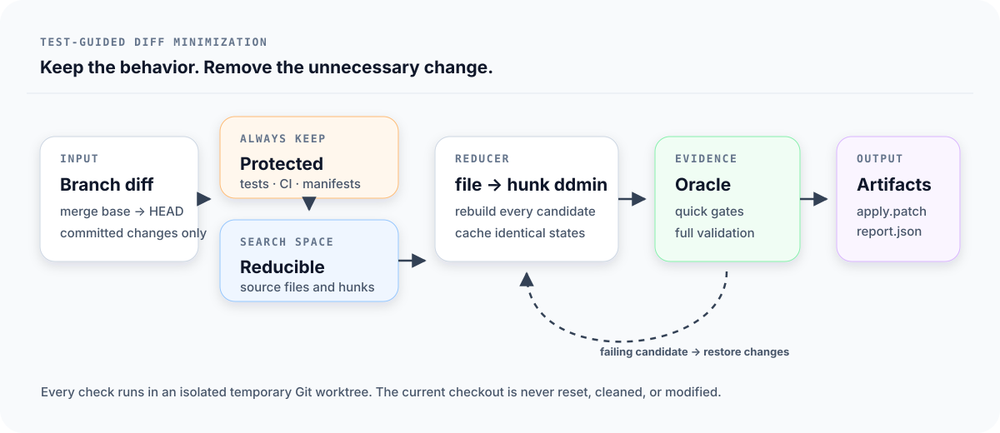

# PatchSlim

[](https://github.com/Apex-Studio-He/patchslim/actions/workflows/ci.yml)
[](package.json)
[](LICENSE)

PatchSlim finds a smaller committed Git diff that still passes the checks you
care about.

Large refactors and experimental changes often leave unrelated files, defensive
abstractions, or redundant hunks in a pull request. PatchSlim treats a focused
test command as an oracle, searches the branch diff in an isolated worktree, and
produces a smaller candidate with the evidence used to accept it.

> PatchSlim is an early preview. A passing candidate is evidence relative to
> the configured checks, not proof of complete behavioral equivalence. Review
> every generated patch.



## What it does

PatchSlim answers a narrow, practical question:

> Which committed changes can be removed while this behavior and its required
> checks still pass?

It does not rewrite code or judge style. It searches subsets of the existing
diff, first by file and then by text hunk.

In the repository fixture used by the test suite:

|               | Original branch | Minimized candidate |
| ------------- | --------------: | ------------------: |
| Changed files |               4 |                   2 |
| Added lines   |               8 |                   6 |
| Deleted lines |               3 |                   2 |

The required feature hunk and its protected test remain. A redundant source
file, a binary change, and an unrelated hunk are removed. This is a
deterministic fixture result, not a general reduction benchmark.

## Install

PatchSlim requires Node.js 20 or newer.

Install the signed release artifact from GitHub:

```bash
npm install --global \
  https://github.com/Apex-Studio-He/patchslim/releases/download/v0.1.0/patchslim-0.1.0.tgz
```

Or build it from source:

```bash
git clone https://github.com/Apex-Studio-He/patchslim.git
cd patchslim
corepack enable
pnpm install --frozen-lockfile
pnpm build
npm link
```

Confirm the command is available:

```bash
patchslim --version
patchslim --json doctor
```

## Quick start

Inspect the committed branch diff and the default protection rules:

```bash
patchslim inspect --base main
```

Create an optional starter configuration:

```bash
patchslim init
```

Minimize the diff with a feature-specific test:

```bash
patchslim minimize \
  --base main \
  --oracle "pnpm vitest run src/auth/login.test.ts" \
  --quick "pnpm typecheck" \
  --gate "pnpm test"
```

PatchSlim prints the artifact paths after successful validation. It never
applies the candidate to the current checkout.

## Commands

| Command                   | Purpose                                                     |
| ------------------------- | ----------------------------------------------------------- |
| `patchslim doctor`        | Check Git, repository, configuration, and runtime readiness |
| `patchslim init`          | Create a conservative `.patchslim.yml`                      |
| `patchslim inspect`       | Show the committed diff and protection classification       |
| `patchslim minimize`      | Search for a smaller passing candidate                      |
| `patchslim report <path>` | Read a JSON run report in human or JSON form                |

Every command supports `--json`. Use `patchslim <command> --help` for all
options.

## How the search works

Each candidate is built from:

```text
merge base + protected changes + selected reducible changes
```

The run has four stages:

1. **Preflight.** The oracle must repeatedly pass on the full head and
   repeatedly fail when all reducible production changes are removed.
2. **File reduction.** Delta debugging searches removable file groups.
3. **Hunk reduction.** Remaining ordinary text files are split into hunks and
   searched again.
4. **Final validation.** The best candidate repeats the oracle and runs every
   full gate before artifacts are written.

Every candidate and every command stage starts from a clean reconstruction in a
temporary Git worktree. Identical candidate states are cached.

## Safety model

PatchSlim fails closed instead of presenting an unsafe candidate when:

| Condition                                              | Result                           |
| ------------------------------------------------------ | -------------------------------- |
| The oracle fails or changes result on the full head    | `HEAD_ORACLE_UNSTABLE`           |
| The oracle passes without reducible production changes | `WEAK_ORACLE`                    |
| Protected-base oracle runs disagree                    | `BASE_ORACLE_UNSTABLE`           |
| A configured gate is already red on the head           | `HEAD_GATE_FAILED`               |
| Setup changes tracked state or creates unignored files | `SETUP_DIRTY`                    |
| A candidate cannot be reconstructed                    | Candidate rejected               |
| A command times out or the run is interrupted          | Run stopped and worktree cleaned |

Tests, fixtures, snapshots, migrations, documentation, CI configuration,
manifests, lockfiles, `.patchslim.yml`, and Git control files are protected by
default. Renames remain protected when either their old or new path matches a
protection rule.

Use `--no-default-protect` only after reviewing the resulting safety boundary.

## Choosing a useful oracle

The oracle defines what “still works” means. Prefer the narrowest deterministic
check that captures the behavior introduced by the branch:

- a focused regression test;
- a package-level test command;
- a reproducible script that exits non-zero when the feature is missing.

A useful feature oracle passes on the branch head and fails on the protected
base candidate. Avoid checks that pass before and after the feature, unstable
tests, and commands that modify external systems.

Use `--runs` to control repeated head, protected-base, and final-candidate
checks. Use `--expect-base-failure` when the base must fail for a specific
reason.

## Configuration

`.patchslim.yml` uses a versioned, strict schema. Unknown keys and unsupported
versions are rejected so misspelled safety settings cannot be ignored silently.

```yaml
version: 1
base: main

oracle:
  command: [pnpm, vitest, run, src/auth/login.test.ts]
  timeout: 5m

setup:
  command: [pnpm, install, --frozen-lockfile]
  timeout: 15m

quickGates:
  - command: [pnpm, typecheck]
    timeout: 5m

fullGates:
  - command: [pnpm, test]
    timeout: 10m

protect:
  - "src/auth/fixtures/**"

runs: 2
budget: 30m
expectedBaseFailure: "login is not implemented"
```

Command-line values override configuration values. A CLI `--timeout` becomes
the default timeout for oracle, setup, and gate commands that do not specify
their own timeout.

## Artifacts

Successful runs write:

| Artifact          | Use                                                            |
| ----------------- | -------------------------------------------------------------- |
| `apply.patch`     | Transform the original head into the minimized candidate       |
| `candidate.patch` | Recreate the minimized candidate from the merge base           |
| `report.json`     | Machine-readable inputs, checks, timings, reduction, and paths |
| `report.md`       | Review-friendly run summary                                    |

The default location is `.git/patchslim/runs/<run-id>/`.

Inspect and apply the head-relative patch manually:

```bash
git apply --check /path/to/apply.patch
git apply /path/to/apply.patch
```

## JSON output

Successful commands return:

```json
{
  "ok": true,
  "command": "inspect",
  "data": {}
}
```

Failures return a non-zero exit status and:

```json
{
  "ok": false,
  "error": {
    "code": "WEAK_ORACLE",
    "message": "The oracle also passes with all reducible production changes removed."
  }
}
```

## Verification

The v0.1.0 release is covered by 38 automated tests across eight test files.

| Area            | Verified behavior                                                        |
| --------------- | ------------------------------------------------------------------------ |
| Reduction       | File and hunk minimization, caching, deterministic results               |
| Preflight       | Weak oracle, unstable head, unstable protected base, red gates           |
| Isolation       | Dirty setup rejection, ignored-cache cleanup, mutating gate isolation    |
| Git changes     | Text, added files, binary data, renames, modes, spaces, Unicode          |
| Artifacts       | `apply.patch` recreates the exact candidate tree from the original head  |
| Process control | Timeouts, secret-like environment filtering, SIGINT cleanup              |
| Configuration   | Precedence, strict schema, duration parsing, expected failure regex      |
| CLI and package | Stable JSON, malformed reports, Node 20/22/24, package lint, clean audit |

Run the same release checks locally:

```bash
pnpm install --frozen-lockfile
pnpm release:check
```

## Security

PatchSlim executes repository-provided setup, oracle, and gate commands with the
current user's host permissions. Run it only in repositories and revisions you
trust. Reports contain captured command output, so review them before sharing.

See [SECURITY.md](SECURITY.md) for the complete trust model.

## Current limitations

- Only committed changes between the base and head revisions are minimized.
- Renames, binary files, mode changes, and protected paths are atomic.
- The reducer seeks a locally minimal passing patch; it does not guarantee the
  globally smallest patch.
- Test coverage and oracle quality determine the quality of the result.
- Ignored directories created by setup are preserved between candidates.
  Disable mutable caches inside dependency directories when reproducibility is
  critical.
- There is no sandboxed or container executor in v0.1.0.

## Contributing

```bash
pnpm install --frozen-lockfile
pnpm check
```

See [CONTRIBUTING.md](CONTRIBUTING.md) before proposing a change. Release history
is available in [CHANGELOG.md](CHANGELOG.md).

## License

MIT
